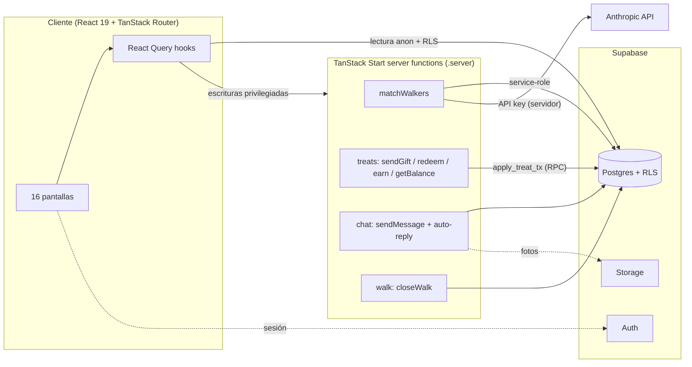
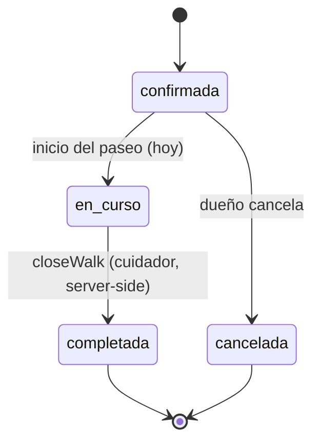
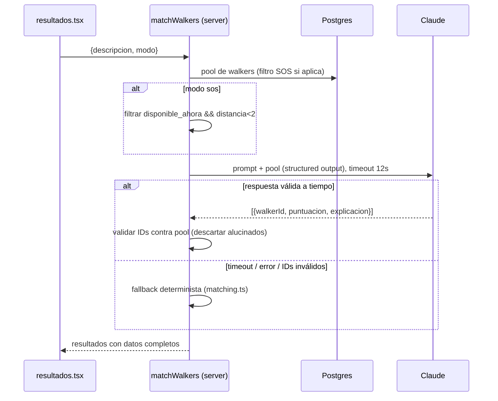

# feat: Convertir el prototipo petbnb en app funcional (Supabase + server functions)

**Target repo:** `petbnb` (rama `development`) · **Construcción:** Claude Code · **Despliegue:** Vercel · **Prototipo (referencia):** generado en Lovable, ya no se usa para construir
**Fecha:** 2026-06-17
**Tipo:** feat
**Profundidad:** Deep
**Referencias:** `PRD PETBNB.md` y `Prompts Lovable petbnb.md` (en el repo `petbnb`)

---

## Summary

El prototipo está 100% construido a nivel de UI (TanStack Start + React 19 + Tailwind v4 + shadcn/ui), con 16 rutas y datos mock en arrays/observables en memoria que no persisten al recargar. Este plan lo convierte en una app funcional: identidad real (Supabase Auth), datos persistentes (Postgres + RLS), matching real con Claude (server function, clave en servidor), y un sistema de treats con saldo y ledger reales. Las claves sensibles y las mutaciones privilegiadas viven en **TanStack Start server functions** (`createServerFn`), siguiendo el patrón que ya trae el repo (`src/lib/api/example.functions.ts`), reservando Supabase para datos, auth, storage y (más adelante) realtime.

Se prioriza una v1 demostrable y enviable: centrada en el dueño, con los cuidadores sembrados y sus acciones (cerrar paseo, responder en chat) automatizadas en el servidor. El pago con tarjeta sigue simulado; los treats sí son saldo real.

---

## Problem Frame

Hoy nada persiste: reservas, chat, treats y saldo viven en memoria (`src/data/chatStore.ts`, `src/data/treatsHistory.ts`, arrays estáticos en `src/data/*.ts`). El matching es determinista por palabras clave (`src/lib/matching.ts`). No hay usuario, ni backend, ni claves. Para que sea una app real (y no solo una demo de clic) hace falta: identidad, persistencia con autorización, una llamada real al modelo, y un manejo correcto del saldo de treats (el área con más riesgo de bugs sutiles).

La restricción de diseño dominante: **no romper la UI ya construida**. Las shapes de datos mock (`Walker`, `Reserva`, `ChatMsg`, `Treat`, `Canje`, etc.) son limpias y se mapean casi 1:1 a tablas. La estrategia es sustituir la *capa de datos* por hooks de React Query + server functions, manteniendo los tipos y las pantallas.

---

## Scope Boundaries

### En alcance (v1 funcional)
- Supabase: proyecto, Postgres con RLS, Auth, Storage (fotos de chat / check-in).
- Auth **ligera** del dueño: sesión anónima por defecto + magic link opcional al reservar (el login nunca bloquea el flujo de búsqueda). Perfil + perro(s).
- Catálogo de paseadores y reseñas servidos desde Postgres (lectura pública).
- Matching real con Claude vía server function (structured output, timeout 12s, fallback determinista).
- Persistencia de reservas (paseo y estancia) con sus estados.
- Persistencia de chat (con auto-respuesta del cuidador simulada en servidor).
- Treats como **saldo y ledger reales**: ganar, regalar, canjear; saldo sin negativos, idempotente.
- Pago con tarjeta **simulado** (compra de treats) + pago con treats real (descuenta saldo).

### Decisiones de alcance resueltas (revertibles)
> Estas tres salieron como call-outs en el arranque; quedan fijadas con el valor recomendado. Si quieres otra cosa, son el primer punto a revisar.
- **D-A. Un solo lado en v1 (dueño).** Los cuidadores se siembran; sus acciones (cerrar paseo, responder chat, confirmar treat) se automatizan en server functions. App de cuidador con cuenta propia → diferida.
- **D-B. Persistido pero simulado.** Chat y seguimiento se guardan en BD, pero las respuestas del cuidador y la animación del paseo siguen guionizadas. Supabase Realtime y GPS real → diferidos.
- **D-C. Treats reales, pago simulado.** El saldo/ledger de treats es real; el formulario de tarjeta es mock; Stripe → diferido.

> **Revisión CEO (2026-06-17) — alcance MEDIO elegido.** Tras la revisión, se reduce el alcance del plan completo a un MVP demostrable: **persistencia real + matching real con Claude**, saltando la complejidad multiusuario.
> - **Auth ligera:** sesión silenciosa/anónima por defecto (magic link opcional al reservar). El login **nunca** bloquea el flujo "describe a tu perro" (regla de demo). RLS básica de "filas propias", sin modelo de dos roles.
> - **Orden de construcción (palanca, no dependencias):** primero **U5 (matching real con Claude)** detrás del fallback existente — es el único valor visible en una demo; luego U1-U2 (Supabase+esquema), U4 (paseadores desde DB), U6/U7 (reservas/chat persistidos), U8 (treats, versión ligera pero server-authoritative).
> - **Tratos como riesgo de negocio:** mantener el pago **simulado**; los treats canjeables por productos reales de partners (Kiwoko/Dr Bimix/Maikai) son casi "dinero/vales" y abren preguntas legales — fuera de esta v1.
> - **Cero pantallas en blanco:** todos los modos de fallo del matching (timeout 12s, error de API, JSON inválido, `walkerId` alucinado, pool SOS vacío) caen al fallback determinista, probado antes que nada. Toda pantalla que lea de BD necesita estado de carga y vacío.

### Deferred to Follow-Up Work
- Supabase Realtime para chat y seguimiento; GPS real.
- App/rol de cuidador (registro, disponibilidad, aceptar/rechazar, cerrar paseo manualmente).
- Pasarela de pago real (Stripe) y fulfillment físico real con partners (Kiwoko / Dr Bimix / Maikai).
- Notificaciones push; verificación de identidad / background check; panel admin; i18n; PWA.

### Fuera del producto (no-goals)
- Paseadores profesionales como marketplace de agencia, clínicas, negocios de mascotas (per PRD).

---

## Requirements

- **R1.** El dueño puede registrarse e iniciar sesión; su sesión persiste entre recargas.
- **R2.** El dueño tiene un perfil con uno o más perros; las reservas y treats quedan asociados a su cuenta.
- **R3.** Los paseadores, reseñas, treats y productos de partners se sirven desde Postgres.
- **R4.** La búsqueda devuelve paseadores rankeados por Claude con explicación específica al texto del dueño; en modo SOS se aplica el filtro duro (disponible ahora + <2 km) antes de llamar al modelo.
- **R5.** Si Claude tarda >12 s o falla, se devuelve un fallback determinista (reusando `matching.ts`); nunca pantalla de error.
- **R6.** La clave de Anthropic y la service-role de Supabase nunca llegan al cliente.
- **R7.** El dueño puede crear reservas de paseo y de estancia; persisten con su estado y se listan en "Mis reservas".
- **R8.** El paseo "en curso" transiciona a "completado" por acción del cuidador (server-side), insertando su mensaje de cierre.
- **R9.** El chat persiste; al enviar un mensaje, el cuidador responde (auto-respuesta server-side) y queda guardado.
- **R10.** Los treats son un saldo real: regalar y canjear descuentan saldo; nunca queda negativo; las operaciones son idempotentes.
- **R11.** El usuario solo puede leer/escribir sus propios datos (reservas, chat, treats) vía RLS.

---

## Key Technical Decisions

- **KTD1 — Backend partido: Supabase (datos/auth/storage) + TanStack server functions (lógica privilegiada).** El repo ya usa `createServerFn` y desaconseja explícitamente Supabase Edge Functions (`src/lib/api/example.functions.ts`). Por tanto: la llamada a Claude y las mutaciones de treats viven como server functions; Supabase es la base de datos, auth, storage. Secretos (`ANTHROPIC_API_KEY`, `SUPABASE_SERVICE_ROLE_KEY`) solo en módulos `*.server.ts` / `config.server.ts`, nunca con prefijo `VITE_`. *(R6)*
- **KTD2 — Sustituir la capa de datos, conservar tipos y UI.** Los stores en memoria (`chatStore.ts`, `treatsHistory.ts`) y arrays estáticos se reemplazan por hooks de React Query (ya instalado, hoy sin uso) que leen Supabase con la anon key + RLS, y por server functions para escrituras privilegiadas. Los tipos TS (`Walker`, `Reserva`, etc.) se mantienen como contrato y se mapean 1:1 a tablas. Minimiza el churn en las 16 pantallas.
- **KTD3 — Treats = ledger append-only + saldo derivado, mutado solo en servidor.** Tabla `treat_transactions` inmutable (credit/debit con `kind`, `idempotency_key` único, `ref`). El saldo se calcula/мantiene en una función SQL (`apply_treat_tx`) con bloqueo de fila y `CHECK`/guard de no-negativo. El cliente nunca escribe treats directamente (RLS deniega INSERT/UPDATE); solo a través de server functions con service-role. Es el área de mayor riesgo. *(R10)*
- **KTD4 — Matching con Claude por structured output + validación + fallback.** Server function `matchWalkers({descripcion, modo})`: carga el pool desde Postgres, aplica el filtro SOS en servidor, llama a Anthropic (`claude-sonnet-4-6`, subir a `claude-opus-4-8` si la calidad flojea) con salida estructurada (tool use / response schema), valida que cada `walkerId` exista en el pool (descarta alucinados), `Promise.race` con timeout 12 s, y cae a `matching.ts` (determinista) si falla. *(R4, R5)*
- **KTD5 — Auth de dueño con Supabase Auth.** Email+contraseña (y magic link opcional). Trigger en `auth.users` que crea fila en `profiles`. Sesión vía `@supabase/supabase-js` con persistencia; contexto de sesión en `__root.tsx`. Rutas de datos del usuario protegidas. *(R1, R2, R11)*

---

## High-Level Technical Design

### Arquitectura



### Modelo de datos (ERD resumido)

```mermaid
erDiagram
  profiles ||--o{ dogs : tiene
  profiles ||--o{ bookings : crea
  profiles ||--o{ chat_threads : participa
  profiles ||--o{ treat_transactions : posee
  walkers ||--o{ reviews : recibe
  walkers ||--o{ bookings : atiende
  walkers ||--o{ chat_threads : conversa
  chat_threads ||--o{ chat_messages : contiene
  partners ||--o{ products : ofrece
  products ||--o{ redemptions : canjeado_en
  profiles ||--o{ redemptions : realiza
  bookings ||--o{ treat_transactions : origina

  profiles { uuid id PK "= auth.users.id" }
  walkers { text id PK }
  bookings { uuid id PK; text estado; text tipo }
  treat_transactions { uuid id PK; int delta; text kind; text idempotency_key }
  chat_messages { uuid id PK; text de }
```

### Ciclo de vida de una reserva (estado)



### Secuencia de matching



---

## Output Structure (nuevos directorios/ficheros)

```
supabase/
  migrations/
    0001_schema.sql          # tablas + RLS + funciones (apply_treat_tx)
    0002_seed.sql            # datos sembrados (walkers, partners, treats, productos)
  config.toml
src/lib/supabase/
  client.ts                  # browser client (anon)
  server.ts                  # service-role client (server-only)
src/lib/server/
  matching.server.ts         # createServerFn matchWalkers
  treats.server.ts           # sendGift / redeem / earn / getBalance
  chat.server.ts             # sendMessage + auto-reply
  walk.server.ts             # closeWalk
src/hooks/
  useWalkers.ts useWalker.ts useBookings.ts useChat.ts useTreats.ts useAuth.ts
src/routes/
  perfil.tsx                 # nueva pantalla de perfil (sin login: sesión anónima + magic link opcional)
```

---

## Implementation Units

### Fase A — Fundación

### U1. Supabase: proyecto, clientes y secretos

**Goal:** Dejar conectado Supabase y el contexto de server functions, sin cambiar comportamiento todavía.
**Requirements:** R6
**Dependencies:** —
**Files:**
- `package.json` (añadir `@supabase/supabase-js`)
- `src/lib/supabase/client.ts` (browser, anon, `VITE_SUPABASE_URL` / `VITE_SUPABASE_ANON_KEY`)
- `src/lib/supabase/server.ts` (service-role, server-only; sin prefijo `VITE_`)
- `src/lib/config.server.ts` (añadir `anthropicApiKey`, `supabaseServiceRoleKey`)
- `.env.example` (documentar todas las vars), `.gitignore` (verificar `.env*`)
- `supabase/config.toml`
**Approach:** Crear proyecto Supabase (vía MCP de Supabase o consola). El cliente browser usa anon key; el cliente server usa service-role y solo se importa desde `*.server.ts`/handlers de `createServerFn` para que se tree-shake del bundle cliente (ver nota en `example.functions.ts`). Verificar que ninguna var sensible lleva prefijo `VITE_`.
**Patterns to follow:** `src/lib/config.server.ts`, `src/lib/api/example.functions.ts`.
**Test scenarios:** Test expectation: none — cableado de infraestructura; se valida en U5/U8 que las claves no aparecen en el bundle cliente (`grep` del build).
**Verification:** `bun run build` no incluye `SERVICE_ROLE`/`ANTHROPIC` en `dist` cliente; un server fn de prueba lee la config.

### U2. Esquema, RLS, funciones SQL y seed

**Goal:** Modelar todo el dominio en Postgres con autorización y sembrar los datos del prototipo.
**Requirements:** R2, R3, R10, R11
**Dependencies:** U1
**Files:**
- `supabase/migrations/0001_schema.sql` — tablas: `profiles`, `dogs`, `walkers`, `reviews`, `bookings`, `chat_threads`, `chat_messages`, `treat_transactions`, `treat_balances` (o vista), `partners`, `products`, `redemptions`; políticas RLS; función `apply_treat_tx(p_user, p_delta, p_kind, p_ref, p_idempotency_key)` con bloqueo de fila y guard de no-negativo; trigger `on_auth_user_created` → `profiles`.
- `supabase/migrations/0002_seed.sql` — portar `src/data/walkers.ts` (12), `partners.ts` (3 marcas + 10 productos), `treats.ts` (5), reseñas y `dias_no_disponibles`.
**Approach:** Mapear shapes mock 1:1 (campos en español como en los tipos actuales). `walkers`/`reviews`/`partners`/`products`/`treats` = lectura pública (RLS `select` para `anon`/`authenticated`). `bookings`/`chat_*`/`treat_transactions`/`redemptions` = solo el dueño (`auth.uid() = user_id`), y escritura de treats **denegada al cliente** (solo service-role). El saldo se deriva de `treat_transactions` o se mantiene en `treat_balances` actualizado por `apply_treat_tx`.
**Patterns to follow:** convención de nombres en español de `src/data/*.ts`.
**Test scenarios:**
- `apply_treat_tx` con delta negativo que dejaría saldo <0 → rechaza y no inserta fila. *(R10)*
- Dos llamadas con el mismo `idempotency_key` → segunda es no-op; saldo cambia una sola vez. *(R10)*
- Cliente autenticado intenta `insert` en `treat_transactions` → denegado por RLS. *(R11)*
- Usuario A consulta `bookings` de usuario B → 0 filas. *(R11)*
- Seed: 12 walkers, ≥3 con `disponible_ahora=true && distancia_km<2`. *(R4)*
**Verification:** Migraciones aplican limpio; `get_advisors` (Supabase) sin warnings de RLS críticos; consultas de seed devuelven los conteos esperados.

### U3. Identidad ligera del dueño + perfil y perros

**Goal:** Dar identidad y sesión persistente **sin que el login bloquee** el flujo de búsqueda (regla de demo).
**Requirements:** R1, R2, R11
**Dependencies:** U1, U2
**Files:**
- `src/hooks/useAuth.ts` (sesión anónima por defecto; vincular email vía magic link; signOut)
- `src/routes/perfil.tsx` (perfil + perro)
- `src/routes/__root.tsx` (proveedor de sesión; crea sesión anónima al cargar, sin guardas que redirijan a login)
- `src/components/Header.tsx`, `src/components/BottomNav.tsx` (acceso a perfil)
**Approach:** Sesión **anónima** de Supabase al cargar la app (sin pantalla de login). El flujo "describe a tu perro → resultados" funciona sin autenticarse. Al **reservar o enviar treats** se *ofrece* (no se obliga) vincular un email por magic link para conservar la cuenta. Las filas (reservas, chat, treats) se asocian al `user_id` de la sesión —anónima o vinculada— y al vincular el email se conservan. RLS de "filas propias". Onboarding mínimo: nombre + un perro.
**Patterns to follow:** validación con Zod (search params actuales); React Hook Form (ya instalado).
**Test scenarios:**
- Abrir la app en frío crea una sesión anónima y el flujo de búsqueda funciona sin login. *(R1)*
- La sesión anónima persiste tras recargar. *(R1)*
- Reservar ofrece vincular email (magic link); se puede continuar sin vincular. *(R2)*
- Tras vincular email, las reservas/treats previas siguen bajo el mismo usuario. *(R2)*
- El usuario solo ve sus propias filas. *(R11)*
**Verification:** Abrir la URL en frío lleva directo a "describe a tu perro" (sin login); reservar y recargar conserva la reserva bajo la misma sesión.

### Fase B — Flujos núcleo funcionales

### U4. Paseadores y perfiles desde Postgres

**Goal:** Servir walkers/reseñas desde Supabase, retirando los arrays estáticos de lectura.
**Requirements:** R3
**Dependencies:** U2
**Files:**
- `src/hooks/useWalkers.ts`, `src/hooks/useWalker.ts`
- `src/routes/index.tsx` ("vecinos cerca de ti"), `src/routes/resultados.tsx`, `src/routes/paseador.$id.tsx`
- `src/data/walkers.ts` (degradar a solo-tipos; el array se vuelve seed/fallback)
**Approach:** React Query lee `walkers`/`reviews` con anon key. Mantener el tipo `Walker`. Estados de carga (reusar skeleton existente) y vacío.
**Patterns to follow:** `ScoreRing`, `SafeImage`, tarjetas actuales de `resultados.tsx`.
**Test scenarios:**
- `useWalkers` mapea fila DB → tipo `Walker` (incluye `tiene_perros`, `ofrece_estancia`). *(R3)*
- `paseador.$id` con id inexistente → estado "no encontrado", sin crash.
- Home renderiza N vecinos desde DB.
**Verification:** Las 3 pantallas pintan idéntico a hoy pero con datos de DB; quitar el array no rompe nada.

### U5. Matching real con Claude (server function)

**Goal:** Reemplazar el matching determinista por Claude, con filtro SOS, validación, timeout y fallback.
**Requirements:** R4, R5, R6
**Dependencies:** U1, U2, U4
**Files:**
- `src/lib/server/matching.server.ts` (`createServerFn` `matchWalkers`)
- `src/lib/matching.ts` (reusar como fallback determinista; exportar la función de scoring)
- `src/routes/buscando.tsx`, `src/routes/resultados.tsx` (invocar el server fn vía React Query)
- `src/lib/server/matching.server.test.ts`
**Approach:** El handler carga el pool de `walkers`; si `modo==="sos"` filtra `disponible_ahora && distancia_km<2` en servidor; llama a Anthropic con structured output (tool use), pидiendo `[{walkerId, puntuacion 0-10, explicacion}]` con la explicación citando atributos del texto; valida IDs contra el pool; `Promise.race([llamada, timeout(12s)])`; en error/timeout/IDs inválidos → `matching.ts`. Clave vía `config.server`. (Consultar la referencia `claude-api` para el id de modelo y el formato de tool use al implementar.)
**Patterns to follow:** `src/lib/api/example.functions.ts` (`createServerFn` + `.inputValidator(zod)`); prompt del PRD.
**Test scenarios:**
- Modo planificado: devuelve 3-5 resultados ordenados por puntuación. *(R4)*
- Modo SOS: solo `disponible_ahora && <2km`, máx 3, nunca vacío (hay ≥3 en seed). *(R4)*
- Claude devuelve un `walkerId` que no está en el pool → se descarta. *(R4)*
- Timeout simulado (>12s) → cae al fallback determinista, mismo shape. *(R5)*
- Error de API (mock throw) → fallback, sin propagar excepción al cliente. *(R5)*
- La explicación incluye un término del texto de entrada (aserción sobre el prompt/salida). *(R4)*
**Verification:** Búsqueda real muestra explicaciones específicas; con la API desconectada, el fallback sigue dando resultados; `grep` del bundle cliente no contiene la API key. *(R6)*

### U6. Persistencia de reservas (paseo + estancia) y cierre por el cuidador

**Goal:** Crear, listar y transicionar reservas reales; el cuidador cierra el paseo en servidor.
**Requirements:** R7, R8, R11
**Dependencies:** U2, U3
**Files:**
- `src/hooks/useBookings.ts`
- `src/lib/server/walk.server.ts` (`closeWalk` → estado `completada` + mensaje de cierre)
- `src/routes/confirmar.$id.tsx` (escribe reserva), `src/routes/reservas.tsx`, `src/routes/reservas.$id.tsx`, `src/routes/paseo.$id.tsx`, `src/routes/completado.$id.tsx`
- `src/data/reservas.ts` (degradar a tipos/seed)
**Approach:** `confirmar` inserta en `bookings` (tipo paseo o estancia, con sus campos distintos). `reservas`/`reservas.$id` leen las del usuario por estado. En `paseo.$id`, al terminar la animación (~25s) se invoca `closeWalk` (server, decisión D-A: cuidador simulado) que pone `completada` e inserta el mensaje "He dejado a {perro} en casa…" en el hilo. Mantener la animación de Leaflet tal cual (D-B).
**Patterns to follow:** flujo 4-pasos existente de `confirmar.$id.tsx`; `WalkMap`.
**Test scenarios:**
- Crear reserva de paseo persiste `hora`+`duracion`; aparece en "Próximas". *(R7)*
- Crear estancia persiste rango+`noches`; flujo distinto al de paseo. *(R7)*
- `closeWalk` transiciona `en_curso`→`completada` e inserta el mensaje de cierre. *(R8)*
- `closeWalk` sobre una reserva ya completada → no duplica mensaje (idempotente).
- Usuario no puede cerrar/leer la reserva de otro. *(R11)*
**Verification:** Reservar → ver en "Mis reservas" → seguir en vivo → al acabar pasa a completada con el mensaje del cuidador; sobrevive a recarga.

### U7. Persistencia de chat (con auto-respuesta del cuidador)

**Goal:** Guardar conversaciones; al escribir, el cuidador responde y queda persistido.
**Requirements:** R9, R11
**Dependencies:** U2, U3
**Files:**
- `src/hooks/useChat.ts`
- `src/lib/server/chat.server.ts` (`sendMessage` → inserta mensaje del dueño + auto-respuesta contextual del cuidador)
- `src/routes/chat.$id.tsx`, `src/routes/mensajes.tsx`
- `src/data/chatStore.ts` (eliminar el observable en memoria)
**Approach:** `chat_threads` por (dueño, walker); `chat_messages` con `de` ∈ {`yo`,`ellos`}. `sendMessage` inserta el del dueño y genera la respuesta del cuidador con la lógica de palabras clave actual (movida al servidor, D-A/D-B). Lectura por polling de React Query en v1 (Realtime diferido). Fotos de check-in vía Storage.
**Patterns to follow:** respuestas contextuales actuales de `chat.$id.tsx`; indicador "escribiendo…".
**Test scenarios:**
- Enviar mensaje persiste dos filas (dueño + cuidador). *(R9)*
- Mención de "ansioso/reactivo" → respuesta contextual acorde. *(R9)*
- Recargar mantiene el hilo. *(R9)*
- `mensajes.tsx` lista hilos del usuario, último mensaje y hora. *(R9)*
- Usuario no ve hilos de otro. *(R11)*
**Verification:** Chat funciona y persiste; al recargar sigue ahí; las fotos enviadas se ven.

### Fase C — Economía de treats (mayor riesgo)

### U8. Saldo y ledger de treats (autoritativo en servidor)

**Goal:** Treats como saldo real, mutado solo en servidor, sin negativos y idempotente; cablear todas las pantallas de treats.
**Requirements:** R6, R10, R11
**Dependencies:** U2, U3
**Files:**
- `src/hooks/useTreats.ts`
- `src/lib/server/treats.server.ts` (`getBalance`, `sendGift`, `redeemProduct`, `earn`)
- `src/routes/treats.$id.tsx`, `src/routes/canjear.$id.tsx`, `src/routes/tienda.tsx`, `src/routes/mis-treats.tsx`, `src/routes/completado.$id.tsx`
- `src/components/PaymentMethodSelector.tsx`, `src/components/TreatButton.tsx`
- `src/data/treatsHistory.ts` (eliminar el observable/saldo en memoria)
- `src/lib/server/treats.server.test.ts`
**Approach:** Toda mutación pasa por `apply_treat_tx` (U2) con `idempotency_key` (p. ej. `gift:{bookingId}:{treatId}` / `redeem:{productId}:{ts}`). `sendGift`: debita saldo y registra envío + dispara la confirmación del cuidador (mensaje+foto). `redeemProduct`: debita y crea `redemption`. `earn`: acredita (bono bienvenida 200🦴 al registrarse, y al completar reserva). Pago con tarjeta = mock que "compra" treats (credita) antes de gastar (D-C). `mis-treats` lee enviados/recibidos/canjes y saldo desde DB.
**Patterns to follow:** `PaymentMethodSelector`, animaciones de hueso/confeti existentes; `treatsHistory.ts` para shapes de enviados/recibidos/canjes.
**Test scenarios:**
- `sendGift` con saldo suficiente debita exacto y crea registro de envío. *(R10)*
- `redeemProduct` cuyo costo > saldo → rechazado, saldo intacto, mensaje "Te faltan X 🦴". *(R10)*
- Doble submit (mismo `idempotency_key`) → una sola transacción. *(R10)*
- `earn` de bienvenida ocurre una vez por usuario (idempotente). *(R10)*
- Cliente intenta mutar saldo directo → RLS deniega. *(R6, R11)*
- `mis-treats` cuadra: saldo = suma de transacciones del usuario. *(R10)*
**Verification:** Regalar/canjear ajusta el saldo de forma consistente y persistente; sin recargar y tras recargar; no hay forma de quedar en negativo ni de duplicar con doble clic.

---

## Risks & Dependencies

- **Ledger de treats (alto).** Saldos negativos, doble gasto o condiciones de carrera. Mitigación: KTD3 (mutación server-only, `apply_treat_tx` con lock + guard, idempotencia) y la batería de tests de U8/U2.
- **Fuga de secretos (alto).** Una var con prefijo `VITE_` se va al bundle. Mitigación: separación `*.server.ts`, `grep` del build en U1/U5, revisión de `.env.example`.
- **Calidad/latencia de Claude (medio).** Explicaciones genéricas o timeouts. Mitigación: structured output + validación de IDs + timeout 12s + fallback determinista; subir a Opus si hace falta.
- **Discrepancia de stack (medio, resuelto).** El PRD asumía Next.js; el repo real es TanStack Start. Este plan se ancla al stack real (server functions, no Next API routes).
- **Migrar la UI sin romperla (medio).** Mitigación: conservar tipos y shapes 1:1; sustituir solo la fuente de datos por hooks.
- **Dependencias externas:** proyecto Supabase aprovisionado (URL/keys), `ANTHROPIC_API_KEY` válida, `@supabase/supabase-js` instalado.

---

## Open Questions (diferidas a implementación)

- ¿Saldo materializado en `treat_balances` o derivado por agregación de `treat_transactions`? Decidir al implementar `apply_treat_tx` según rendimiento/simplicidad.
- ¿Polling interval del chat en v1 antes de Realtime? Ajustar en U7 con datos reales.
- Id exacto del modelo y formato preciso de tool use de Anthropic: confirmar con la referencia `claude-api` en U5.
- ¿Lectura de `walkers` con anon key directa o vía server fn para ocultar columnas sensibles? Evaluar en U4 según qué campos son públicos.

---

## Sources & Research

- Investigación del repo `paseo-confiado-bnb`: TanStack Start v1.167 + React 19 + Tailwind v4 + shadcn/ui + Leaflet + Framer Motion; 16 rutas; datos mock en `src/data/*` (observables `chatStore.ts`/`treatsHistory.ts`); matching en `src/lib/matching.ts`; patrón server fn en `src/lib/api/example.functions.ts` (recomienda server fns sobre Edge Functions); sin Supabase/auth/tests.
- `PRD PETBNB.md` y `Prompts Lovable petbnb.md` (repo `petbnb`): concepto, modos planificado/SOS, prompt de matching, treats/partners.
- Aprendizajes institucionales: no existe base previa (`docs/solutions/` ausente). Candidatos a capturar con `/ce-compound` tras implementar: contrato de structured output + timeout/fallback, API key server-only, diseño del ledger de treats, políticas RLS, persistencia de chat.

---

## GSTACK REVIEW REPORT

**Skill:** plan-ceo-review · **Fecha:** 2026-06-17 · **Repo:** mariacortizasarnoso-max/paseo-confiado-bnb · **Rama:** development
**Modo:** Reducción de alcance → Hold del alcance medio · **Enfoque elegido (0C-bis):** Medio (persistir + matching real)

| Run | Estado | Hallazgos clave |
| --- | --- | --- |
| Reto a la premisa (0A) | Absorbido | El PRD era una demo de hackathon ("solo la llamada a Claude es real"); "todo funcional" invierte eso. Se confirma objetivo = MVP demostrable, no producto completo. |
| Alternativas de implementación (0C-bis) | Resuelto | A (solo matching) / B (v1 Supabase completa) / C (medio). Elegido **C**. |
| Modos de fallo (matching) | Abierto → mitigado en plan | timeout 12s, error API, JSON inválido, `walkerId` alucinado, pool SOS vacío → todos al fallback determinista, probado primero. |
| Seguridad de secretos | Abierto → mitigado en plan | `ANTHROPIC_API_KEY` solo en `.server.ts`, nunca `VITE_`; verificación por `grep` del build (U1/U5). |
| Integridad del saldo de treats | Abierto → mitigado en plan | Mutación server-side, guard de no-negativo, idempotencia (U8), incluso en versión ligera. |
| UX funcional vs mock | Abierto → mitigado en plan | Estados de carga/vacío en toda pantalla que lea de BD; login nunca bloquea el flujo de búsqueda. |
| Riesgo de negocio (treats/partners) | Diferido | Treats canjeables = casi vales/dinero; pago real y fulfillment de partners fuera de v1. |

**VERDICT:** Plan aprobado con alcance reducido a "medio". Prioridad de construcción reordenada por palanca (matching real primero). Sin cambios de código realizados (solo revisión).

**Recortado explícitamente de la v1 (escrito para que no se olvide):** app/rol de cuidador, auth multiusuario y RLS endurecida, pagos reales (Stripe), realtime/GPS, notificaciones push, fulfillment real con partners.

NO UNRESOLVED DECISIONS
